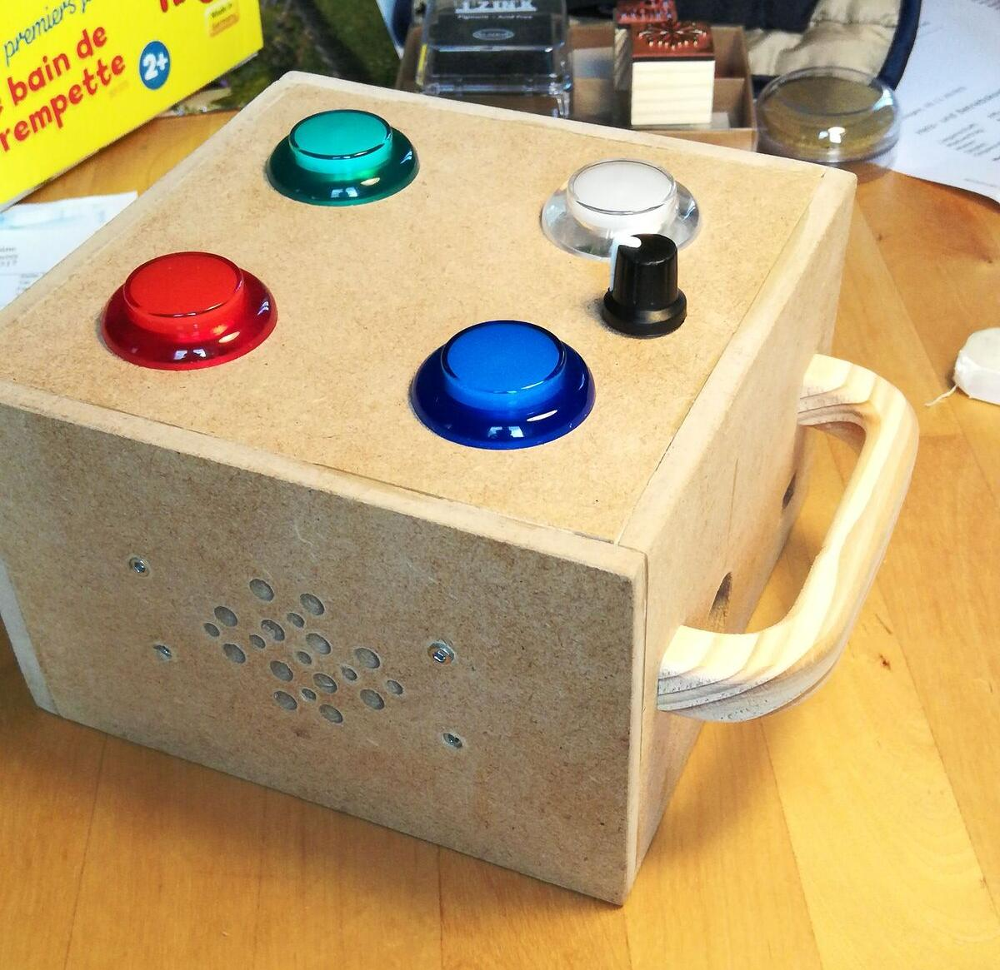
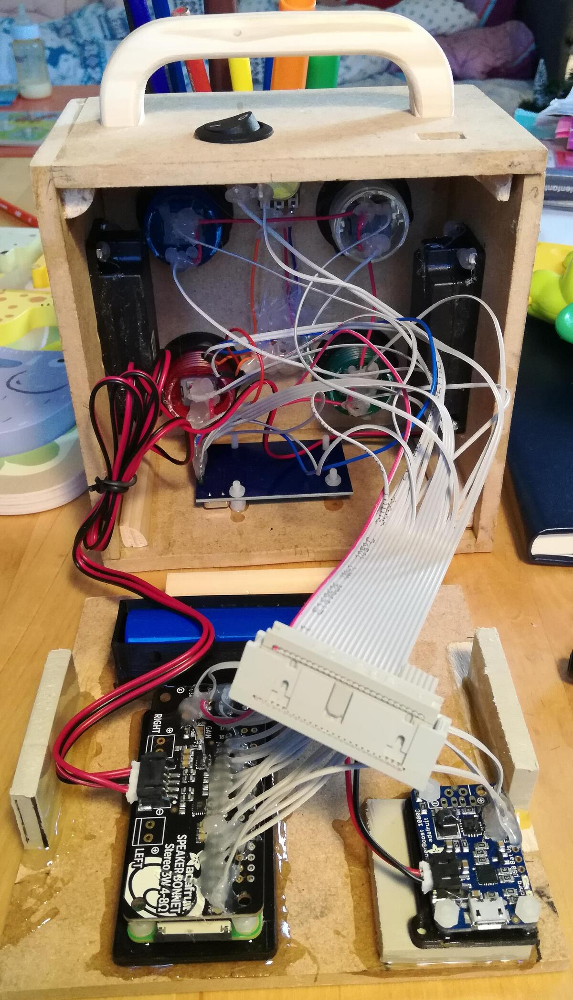

# BommBox Pi

## What is this?
A simple music player for my daughter's homemade boombox. The box supports multiple playlists of mp3 files. 

The code in this repo provides both backend to interface with the hardware (4 arcade buttons with LED, a potentiometer and a NFC reader) and frontend to manage the player from a small web interface. It also provides a REST API to integrate third party clients.

## Pictures
- Finished music box
  
  

- Electronic components
  - 4 Arcade buttons (play/pause, next, previous, change playlist)
  - 1 Potentiometer for volume control
  - 2 Speakers
  - 1 NFC module to read/write cards for quick access to songs and playlists
  - 1 Raspberry Pi Zero 2W
  - 1 Speaker Bonnet from Adafruit
  - 1 Battery
  - 1 Battery USB Charger
  - On/Off switch
  - Just too many wires
  
  

### External Credits
- Icons ["Music Icons 5"](https://www.pngrepo.com/collection/music-icons-5/) from PNG Repo, Creative Commons 4.0